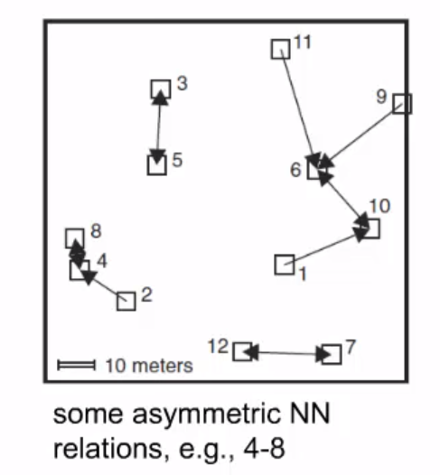

```{r setup, include=FALSE}
knitr::opts_chunk$set(echo = TRUE)
library(spatstat)
library(sp)
library(spatialEco)

```

## Nearest Neighbour index

- Nearest Neighbour index



## Mean Nearest Neighbour distance


$$
\begin{aligned}
\bar{d}_{obs} = \frac{\sum_{i=1}^n d_{min}(s_i)}{n} && \bar{d}_{exp} = 0.5/\sqrt{n/Area}
\end{aligned}
$$

,where $n$ is the number of events, and $\bar{d}_{exp}$ expected min distances under complete spacial randomness (CSR).

Nearest Neighbour index:

$$
\begin{aligned}
\bar{d}_d = \bar{d}_{obs} - \bar{d}_{exp} && d_r = \bar{d}_{obs} / \bar{d}_{exp}
\end{aligned}
$$

```{r echo=FALSE}
tmp<-data.frame(Difference = c("d<0",0,"d>0"),Pattern = c("Clustered", "Random", "Dispersed"), Ratio=c("d<1",1,"d>1"))
knitr::kable(tmp)
```

## Hypothesis testing

Is the observed pattern significantly different from an spatial random pattern?

$$
\begin{aligned}
Z = \frac{\bar{d}_{obs}-\bar{d}_{exp}}{SE} && SE = 0.26136/ \sqrt{n^2/Area}
\end{aligned}
$$

Z - score is normally distributed, therefore:

```{r echo=FALSE}
tmp <- data.frame (Z = c("z > 1.96","z < -1.96"), "pattern" = c("dispersed", "clustered")) 
knitr::kable(tmp)
```

## Simulation

Simulate datasets of different size using `runifpoint` to verify the numbers above.

```{r echo=FALSE}
sidesize <- 100
area <- sidesize * sidesize
n <- c(5 , 10, 50, 100, 500, 1000, 10000)
res <- list()
for(i in 1:length(n)){
  res[[i]] <- plyr::adply(1:1000,1,
                     function(x){
                       pois <- runifpoint(n[i], win=c(c(0,sidesize), c(0,sidesize)))
                       #pois <- rpoispp(lambda = 5, win = c(c(0,100), c(0,100)))
                       n<-nrow(data.frame(pois))
                       c(n = n , mean = mean(nndist(pois)))
                     })
}


stats<-function(tmp){c(
  d_exp = mean(tmp$mean) * sqrt(mean(tmp$n)/area),
  sd_exp = sd(tmp$mean)* sqrt(mean(tmp$n)^2/area))
}


res <- plyr::ldply(
  res, stats
)

par(mfrow=c(1,2))
plot(n, res$d_exp,log="x", ylim=c(0.49, 0.65), type="b", xlab="number of points", ylab=expression(d[exp]))
abline(h=0.5,col=2)
plot(n, res$sd_exp, log="x", ylim=c(0.25,0.4), type="b", xlab="number of points",
     ylab=expression(SE))
abline(h=0.26136,col=2)

```

## Example

```{r echo=FALSE, message=FALSE, warning=FALSE, fig.width=8, fig.width=8}

pois <- rpoispp(lambda = 1, win = c(c(0,10), c(0,10)))
rSSI <- rSSI(r=1, n = 100, win = c(c(0,10),c(0,10)))
rClust <- rMatClust(kappa = 0.1, mu = 20,  win = c(c(0,10), c(0,10)), r = 0.5)

mnni <- function(spst){
  unlist(spatialEco::nni(SpatialPoints(data.frame(spst))))
}

load("Drugs.ppp")

tmp <- data.frame(Pois = mnni(pois),
rSSI = mnni(rSSI),
Clustered= mnni(rClust),
Drugs = mnni(Drugs.ppp))

knitr::kable(tmp,digits = 2)

```


## Other function based on nearest neighbour distance

There is the G and F function which are both based on the NND.

```{r echo=FALSE, fig.width=10,fig.height=5}
runif <- runifpoint(1000, win=c(c(0,100), c(0,100)))
par(mfrow=c(1,4))

plot(Gmulti(pois, 1:nrow(data.frame(pois)),1:nrow(data.frame(pois))), main="pois")
#plot(Gmulti(rSSI, 1:nrow(data.frame(rSSI)),1:nrow(data.frame(rSSI))), main="disperse")
plot(Gmulti(rClust, 1:nrow(data.frame(rClust)),1:nrow(data.frame(rClust))), main="clustered")
plot(Gmulti(Drugs.ppp, 1:nrow(data.frame(Drugs.ppp)),1:nrow(data.frame(Drugs.ppp))), main="Drugs Example")

```

## Summary

* Advantage of NNI:
    + No quadrants need to be defined
    + Some control over of Type one type errors
* Disadvantage :
    + overestimate $d_{obs}$.
    + Assumption for Z - score $d_{exp}$ and $SE$ are not met for small sample sizes.
  